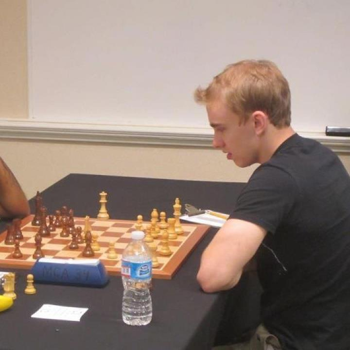

<head>
<link rel="stylesheet" href="https://cdnjs.cloudflare.com/ajax/libs/font-awesome/4.7.0/css/font-awesome.min.css">
<link rel="stylesheet" href="https://cdn.rawgit.com/jpswalsh/academicons/master/css/academicons.min.css">

  <a href="../">Home</a>
  <a href="../../about">About</a>
  <a href="../blog">Blog</a>
  <a href="../publications">Publications</a>
  <a href="../contact">Contact</a>
  <a class="active" href="https://github.com/benkrause" style="float:right;"><i class="fa fa-github"></i></a>
  <a class="active" href="https://scholar.google.com/citations?user=ONNif60AAAAJ&hl=en&authuser=1" style="float:right; "><i class="ai ai-google-scholar-square ai-1"></i></a>  

<link rel="icon" href="https://benkrause.github.io/favicon.ico">
</head>

##Chess

I've played competitive chess on and off for a good part of my life, and achieved the US national master title. I am mostly retired now, but sometimes still play for fun. Here is a <a href="http://www.connectionnewspapers.com/news/2003/apr/23/check-out-the-chess-champs/">funny article</a> about an 11-year old me and my chess team.

<body style = "background-image: url('../../images/neurons2.jpg');background-repeat: no-repeat; background-position: right 50px ;background-size: 100% 140px;">
</body>
